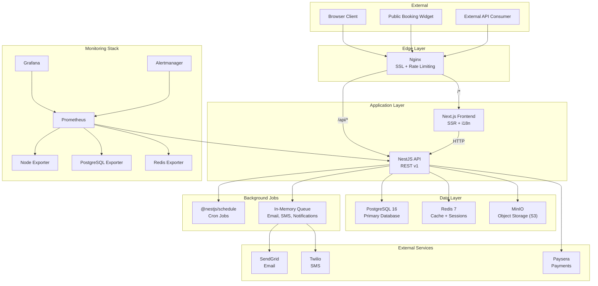
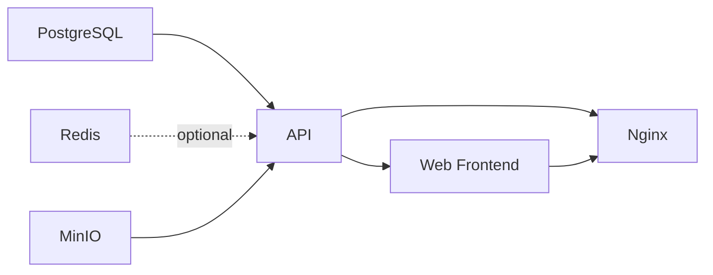
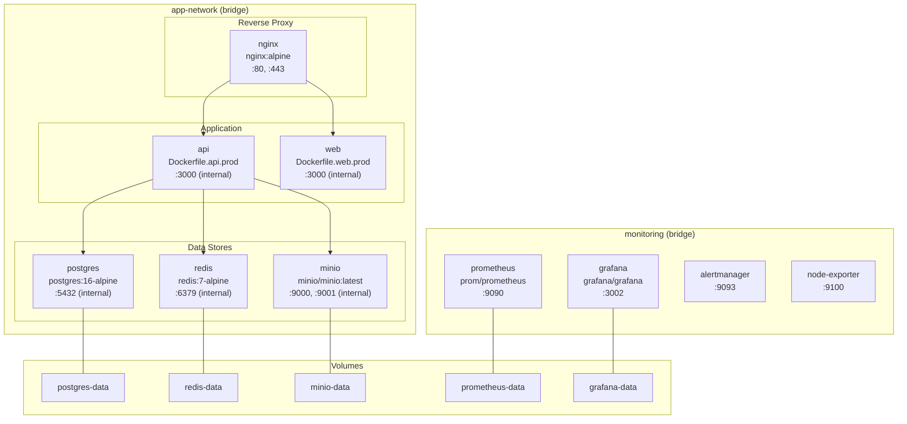
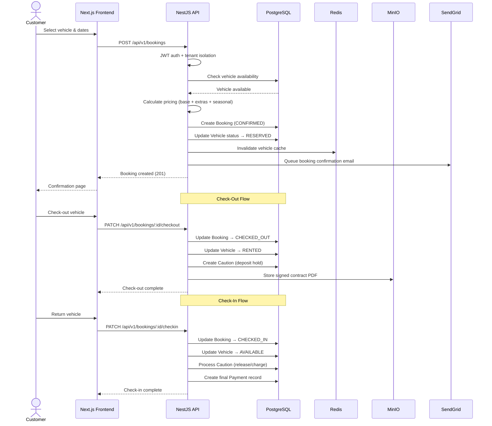
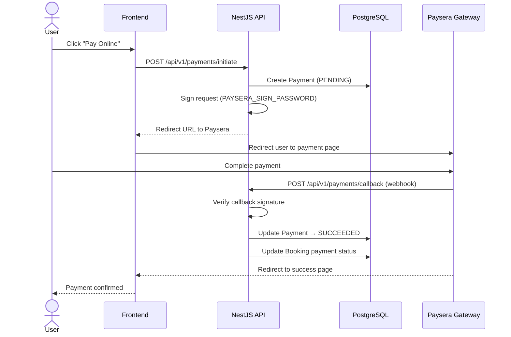
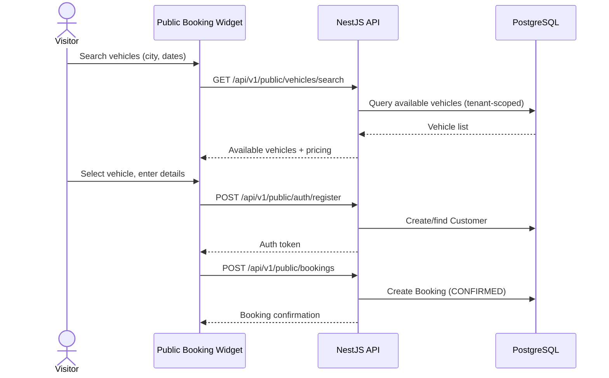
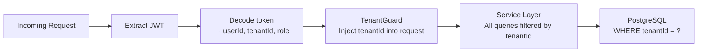
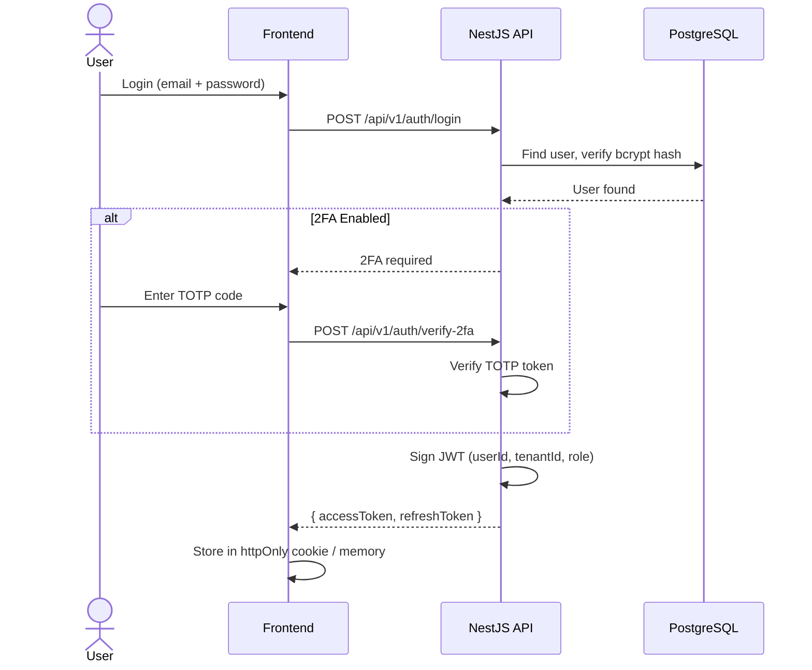

# FleetPulse Architecture Overview

> **Last Updated:** 2026-02-06
> **Audience:** Engineers, Architects, New Team Members

---

## Table of Contents

- [1. System Overview](#1-system-overview)
- [2. Component Architecture](#2-component-architecture)
- [3. Infrastructure Diagram](#3-infrastructure-diagram)
- [4. Data Flow: Key Operations](#4-data-flow-key-operations)
- [5. Multi-Tenancy Model](#5-multi-tenancy-model)
- [6. Security Architecture](#6-security-architecture)
- [7. Module Reference](#7-module-reference)
- [8. Technology Stack](#8-technology-stack)

---

## 1. System Overview

FleetPulse is a multi-tenant SaaS platform for car rental fleet management. It provides booking management, vehicle lifecycle tracking, payments, maintenance scheduling, customer management, and operational analytics -- all with complete tenant data isolation.

### High-Level Architecture

```
┌──────────────────────────────────────────────────────┐
│                     Clients                          │
│  (Browser / Mobile / Public Booking Widget / API)    │
└─────────────────────┬────────────────────────────────┘
                      │ HTTPS (TLS 1.2+)
                      ▼
┌──────────────────────────────────────────────────────┐
│                 Nginx Reverse Proxy                  │
│       (SSL termination, rate limiting, gzip)         │
│            Port 80 → 301 → Port 443                  │
└───────┬─────────────────────────────┬────────────────┘
        │ /api/*                      │ /*
        ▼                             ▼
┌─────────────────┐         ┌──────────────────┐
│   NestJS API    │         │  Next.js Web App │
│   (Port 3000)   │         │   (Port 3000)    │
│                 │         │  i18n (en/it/sq)  │
│  REST API v1    │◄────────│  Server-side      │
│  JWT Auth       │  HTTP   │  React + Tailwind │
│  RBAC           │         │  shadcn/ui        │
└──┬────┬────┬────┘         └──────────────────┘
   │    │    │
   ▼    ▼    ▼
┌──────┐ ┌──────┐ ┌──────┐
│Postgr│ │Redis │ │MinIO │
│ SQL  │ │Cache │ │  S3  │
│  16  │ │  7   │ │      │
└──────┘ └──────┘ └──────┘
```

---

## 2. Component Architecture

### Mermaid Component Diagram



### Service Dependency Chain



**Hard dependencies:** PostgreSQL must be healthy before API starts.
**Soft dependencies:** Redis is optional (graceful fallback). MinIO is required for file operations only.

---

## 3. Infrastructure Diagram

### Docker Services (Production)



### Resource Limits (Production)

| Container | CPU | Memory | Restart Policy |
| --------- | --- | ------ | -------------- |
| API | 1 vCPU | 512 MB | always |
| Web | 1 vCPU | 512 MB | always |
| PostgreSQL | 1 vCPU | 1 GB | always |
| Redis | 0.5 vCPU | 256 MB | always |
| MinIO | 0.5 vCPU | 512 MB | always |

### Port Mapping (Production)

In production, only Nginx exposes external ports. All other services communicate internally via the Docker bridge network.

| External Port | Internal Service | Protocol |
| ------------- | ---------------- | -------- |
| 80 | Nginx (HTTP -> 301 HTTPS) | TCP |
| 443 | Nginx (HTTPS) | TCP |
| 9090 | Prometheus (monitoring only) | TCP |
| 3002 | Grafana (monitoring only) | TCP |

---

## 4. Data Flow: Key Operations

### 4.1 Booking Flow



### 4.2 Payment Flow (Paysera)



### 4.3 Public Booking Flow



---

## 5. Multi-Tenancy Model

### Architecture Pattern: Row-Level Isolation

FleetPulse uses a **shared database, shared schema** multi-tenancy model with row-level isolation. Every tenant-scoped entity includes a `tenantId` foreign key.

```
┌─────────────────────────────────────────┐
│            Single PostgreSQL DB         │
│                                         │
│  ┌──────────┐  ┌──────────┐            │
│  │ Tenant A │  │ Tenant B │  ...       │
│  │ vehicles │  │ vehicles │            │
│  │ bookings │  │ bookings │            │
│  │ customers│  │ customers│            │
│  └──────────┘  └──────────┘            │
│                                         │
│  WHERE tenantId = 'current_tenant'      │
└─────────────────────────────────────────┘
```

### Tenant Resolution Flow



### Key Tenant-Scoped Entities

| Entity | Tenant-Scoped | Notes |
| ------ | ------------- | ----- |
| Tenant | Root entity | Contains subscription info |
| User | Yes | Each user belongs to one tenant |
| Vehicle | Yes | Fleet is per-tenant |
| Customer | Yes | Customer base is per-tenant |
| Booking | Yes | Through vehicle/customer |
| Payment | Yes | Through booking |
| Caution | Yes | Through booking |
| Damage | Yes | Through vehicle |
| Maintenance | Yes | Through vehicle |
| Tire | Yes | Through vehicle |
| Branch | Yes | Physical locations per-tenant |
| Document | Yes | Contracts, invoices |
| FuelLog | Yes | Through vehicle |
| Notification | Yes | Per-tenant notifications |

### Subscription & Plan Limits

Each tenant has a subscription with plan-based limits enforced via the `@PlanLimit()` decorator:

| Plan Feature | Enforced At |
| ------------ | ----------- |
| Max vehicles | Vehicle creation |
| Max users | User invitation |
| Max branches | Branch creation |
| Feature flags | Module/endpoint level |

### SuperAdmin Layer

A separate `AdminModule` provides cross-tenant management for platform operators (tenant CRUD, subscription management, audit logs). SuperAdmin routes are protected by role-based guards and optionally restricted by IP in Nginx.

---

## 6. Security Architecture

### 6.1 Authentication Flow



### 6.2 Authorization Model (RBAC)

```
┌─────────────────────────────────────────────┐
│                  SUPERADMIN                  │
│        (Platform-level, cross-tenant)        │
├─────────────────────────────────────────────┤
│                   ADMIN                      │
│  (Tenant owner, full tenant management)      │
├─────────────────────────────────────────────┤
│                  MANAGER                     │
│  (Manage bookings, vehicles, customers)      │
├─────────────────────────────────────────────┤
│                  OPERATOR                    │
│  (Day-to-day operations, limited access)     │
└─────────────────────────────────────────────┘
```

| Capability | SuperAdmin | Admin | Manager | Operator |
| ---------- | ---------- | ----- | ------- | -------- |
| Manage tenants | Yes | -- | -- | -- |
| Manage subscription | Yes | Yes | -- | -- |
| Manage users | Yes | Yes | -- | -- |
| Manage vehicles | Yes | Yes | Yes | View only |
| Manage bookings | Yes | Yes | Yes | Yes |
| Manage customers | Yes | Yes | Yes | View only |
| View analytics | Yes | Yes | Yes | -- |
| View audit logs | Yes | Yes | -- | -- |
| Manage API keys | Yes | Yes | -- | -- |
| Manage email templates | Yes | Yes | -- | -- |

### 6.3 API Security Layers

```
Request → Nginx Rate Limit → CORS Check → Helmet Headers
       → JWT Validation → Tenant Guard → Role Guard
       → Plan Limit Check → Input Validation (class-validator)
       → Controller → Service → Prisma (parameterized queries)
```

| Layer | Technology | Configuration |
| ----- | ---------- | ------------- |
| TLS | Let's Encrypt + Nginx | TLS 1.2 / 1.3, HSTS |
| Rate Limiting (Nginx) | `limit_req_zone` | 10 req/s (API), 30 req/s (Web) |
| Rate Limiting (App) | `@nestjs/throttler` | 100 req / 60s per IP |
| CORS | NestJS CORS | Strict origin (no wildcards in prod) |
| Security Headers | Helmet.js | CSP, X-Frame-Options, HSTS, X-XSS |
| Authentication | JWT (jsonwebtoken) | HS256, configurable expiry (default 7d) |
| 2FA | TOTP (speakeasy) | Optional per-user |
| Authorization | Custom RBAC Guards | Role-based + Tenant-scoped |
| Input Validation | class-validator / Zod | DTO validation on all endpoints |
| SQL Injection | Prisma ORM | Parameterized queries only |
| XSS Prevention | Input sanitization | Request sanitization middleware |
| Audit Logging | Custom AuditService | All mutations logged with user + tenant |
| Correlation IDs | Custom Middleware | `X-Correlation-ID` on every request |

### 6.4 Data Encryption

| Data | At Rest | In Transit |
| ---- | ------- | ---------- |
| Passwords | bcrypt (configurable rounds) | TLS |
| JWT tokens | -- | TLS, httpOnly cookies |
| Database | Volume encryption (host-level) | Internal Docker network |
| File storage | MinIO volume encryption | TLS (configurable) |
| Sensitive fields | AES-256 application-level | TLS |

---

## 7. Module Reference

### Backend API Modules (`apps/api/src/modules/`)

| Module | Purpose | Key Entities |
| ------ | ------- | ------------ |
| `auth` | Authentication, JWT, 2FA | User sessions |
| `public-auth` | Public-facing auth (customer portal) | Customer auth |
| `customers` | Customer management | Customer, CustomerStatus |
| `vehicles` | Fleet management | Vehicle, VehicleStatus, VehicleCategory |
| `bookings` | Booking lifecycle | Booking, BookingStatus |
| `public-bookings` | Public booking widget API | Public booking flow |
| `payments` | Payment processing (Paysera) | Payment, PaymentStatus |
| `payouts` | Tenant payouts | Payout, PayoutStatus |
| `cautions` | Security deposits | Caution, CautionStatus |
| `damages` | Damage reporting | Damage, DamageSeverity |
| `maintenance` | Vehicle maintenance | Maintenance, MaintenanceType |
| `tires` | Tire tracking | Tire records |
| `fuel-logs` | Fuel consumption tracking | FuelLog |
| `documents` | Document management | Contracts, invoices |
| `upload` | File upload (MinIO) | Presigned URLs |
| `notifications` | Email, SMS, in-app | Notification, NotificationType |
| `email-templates` | Custom email templates | Per-tenant templates |
| `analytics` | Dashboards and KPIs | Aggregated metrics |
| `reports` | Report generation | CSV/PDF exports |
| `subscription` | Plan management | Subscription, SubscriptionStatus |
| `users` | User management | User, Role |
| `branches` | Branch/location management | Branch |
| `tenants` | Tenant self-management | Tenant settings |
| `admin` | SuperAdmin operations | Cross-tenant management |
| `api-keys` | API key management | External integrations |
| `audit-logs` | Audit trail | All mutation logs |
| `search` | City/location search | Search index |

### Common Services (`apps/api/src/common/`)

| Service | Purpose |
| ------- | ------- |
| `LoggerService` | Structured logging with correlation IDs |
| `MetricsService` | Prometheus metrics exposure |
| `RedisCacheService` | Cache layer with graceful fallback |
| `StorageService` | MinIO file operations + presigned URLs |
| `AuditService` | Immutable audit trail for all mutations |
| `CorrelationIdMiddleware` | Request tracing via `X-Correlation-ID` |
| `LoggingInterceptor` | Request/response logging |
| `CacheInvalidateInterceptor` | Auto-invalidate cache on writes |
| `ThrottleCustomGuard` | Per-route rate limiting |
| `QueueModule` | In-memory job queue for async tasks |

---

## 8. Technology Stack

### Backend

| Technology | Version | Purpose |
| ---------- | ------- | ------- |
| Node.js | 18+ | Runtime |
| NestJS | 10.x | API framework |
| Prisma | 5.x | ORM + migrations |
| PostgreSQL | 16 | Primary database |
| Redis | 7 | Caching |
| MinIO | Latest | S3-compatible object storage |
| class-validator | Latest | DTO validation |
| Passport + JWT | Latest | Authentication |
| @nestjs/schedule | Latest | Cron jobs |
| @nestjs/throttler | Latest | Rate limiting |

### Frontend

| Technology | Version | Purpose |
| ---------- | ------- | ------- |
| Next.js | 14.x | React framework (App Router) |
| React | 18.x | UI library |
| TypeScript | 5.x | Type safety |
| Tailwind CSS | 3.x | Styling |
| shadcn/ui | Latest | Component library |
| next-intl | Latest | i18n (en, it, sq) |
| Zod | Latest | Schema validation |

### Infrastructure

| Technology | Purpose |
| ---------- | ------- |
| Docker + Docker Compose | Containerization |
| Nginx | Reverse proxy, SSL, rate limiting |
| Let's Encrypt | SSL certificates |
| GitHub Actions | CI/CD pipeline |
| GitHub Container Registry | Docker image registry |

### Monitoring

| Technology | Purpose |
| ---------- | ------- |
| Prometheus | Metrics collection (15s interval) |
| Grafana | Dashboards and visualization |
| Alertmanager | Alert routing (email + Slack) |
| Node Exporter | System metrics |
| PostgreSQL Exporter | Database metrics |
| Redis Exporter | Cache metrics |

### External Services

| Service | Purpose |
| ------- | ------- |
| SendGrid | Transactional email |
| Twilio | SMS notifications |
| Paysera | Payment gateway |
